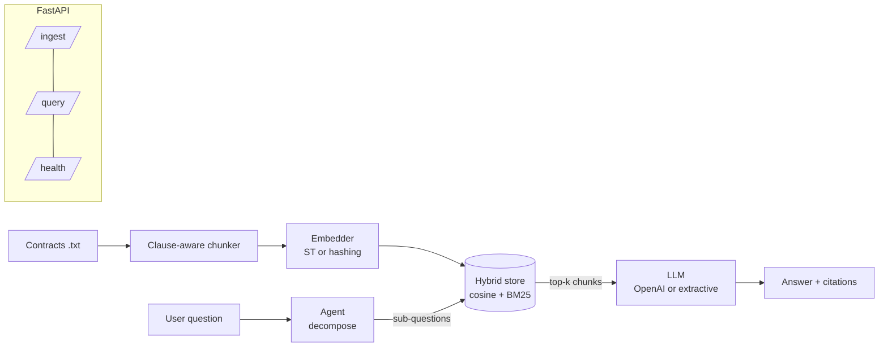

# ClauseIQ — Agentic RAG for Contract Intelligence

[](https://colab.research.google.com/github/akshay-birla-03/clauseiq/blob/main/notebooks/Run_in_Colab.ipynb)


[](https://github.com/akshay-birla-03/clauseiq/actions)
[](https://www.python.org/)
[](LICENSE)
[](https://github.com/astral-sh/ruff)

**ClauseIQ** is a production-shaped Retrieval-Augmented Generation service that answers
natural-language questions about legal contracts **with clause-level citations** — and
refuses to answer when the contract doesn't support it. It ships with an **agentic
query-decomposition** layer, a **hybrid (dense + BM25) retriever**, and a **repeatable
evaluation harness**.

> Runs **fully offline with zero API keys** out of the box (deterministic hashing
> embeddings + grounded extractive answerer), and transparently upgrades to
> **SentenceTransformers** and **OpenAI** when those are configured. That design keeps
> CI hermetic and lets a reviewer clone-and-run in under a minute.

---

## Why this project is interesting

Most RAG demos hide two hard problems: **grounding** (not hallucinating) and
**evaluation** (proving it works). ClauseIQ makes both first-class:

- **Grounding by construction** — every answer carries `[doc_id::chunk]` citations that
  are validated against the live index; the offline backend can only quote retrieved text.
- **Agentic decomposition** — compound questions ("notice period *and* breach cure?") are
  split into sub-questions, retrieved independently, then fused — measurably improving
  recall on multi-facet queries.
- **Clause-aware chunking** — splits on `Article/Section/1.2` boundaries instead of blind
  fixed windows, so a retrieved chunk is usually a self-contained clause.
- **Hybrid retrieval** — dense cosine fused with BM25 (`alpha` configurable), min-max
  normalised — the standard production pattern, implemented transparently.
- **Honest eval harness** — `retrieval_hit@k`, `answer_coverage`, `grounding` on a gold set.

## Architecture



## Quickstart

```bash
git clone https://github.com/akshay-birla-03/clauseiq.git && cd clauseiq
python -m venv .venv && source .venv/bin/activate
pip install -e ".[dev]"

python scripts/generate_contracts.py      # build synthetic corpus + eval set
pytest -q                                  # run the test-suite (offline)

# Ask a question from the CLI
clauseiq ask "What is the termination notice period and the breach cure window?"

# Serve the API
uvicorn clauseiq.api:app --reload
# -> POST http://localhost:8000/query  {"question": "..."}

# Optional Streamlit UI
streamlit run src/clauseiq/ui_streamlit.py
```

### Upgrade to real models (optional)

```bash
pip install -e ".[ml,llm]"
export OPENAI_API_KEY=sk-...              # enables OpenAI answerer
export CLAUSEIQ_EMBEDDING_BACKEND=sentence-transformers
```

## Example

```bash
$ clauseiq ask "How many days to cure a material breach under msa_01?"
{
  "answer": "Based on the contract clauses:\n- Either party may terminate immediately if
             the other party commits a material breach that remains uncured for 15 days
             ... [msa_01::3]",
  "citations": [{"doc_id": "msa_01", "chunk_id": "msa_01::3", "score": 0.83, ...}],
  "sub_questions": [],
  "backend": {"llm": "extractive"}
}
```

## Evaluation

```bash
python -m clauseiq.eval.harness --cases data/eval_cases.json
```

| Metric            | Meaning                                             |
|-------------------|-----------------------------------------------------|
| `retrieval_hit@k` | relevant document present in top-k                  |
| `answer_coverage` | expected facts present in the answer                |
| `grounding`       | citations that resolve to real indexed chunks       |

The gold set is generated alongside the corpus so numbers are reproducible on any machine.

## Design decisions & trade-offs

- **In-process hybrid store, not a hosted vector DB.** Keeps the reference readable and
  the tests hermetic. The `HybridVectorStore` interface is a drop-in seam for Qdrant/pgvector.
- **Pluggable backends via `auto`.** The service degrades gracefully instead of hard-failing
  when a key/model is missing — the same code path runs in CI and in production.
- **Extractive fallback is a feature, not a toy.** It guarantees grounded output and gives a
  deterministic baseline to evaluate the LLM answerer against.

## Project layout

```
src/clauseiq/
  chunking.py     clause-aware splitter
  embeddings.py   ST / hashing embedders (auto)
  vectorstore.py  hybrid dense+BM25 store (+persistence)
  llm.py          OpenAI / extractive answerers (auto)
  agent.py        query decomposition + fusion
  pipeline.py     orchestration
  api.py          FastAPI service
  eval/harness.py reproducible metrics
tests/            unit + integration tests
```

## Roadmap

- Reranking with a cross-encoder
- Streaming responses + async ingestion
- Qdrant backend behind the existing store interface
- LLM-as-judge faithfulness scoring in the eval harness

## License

MIT © Akshay Birla
